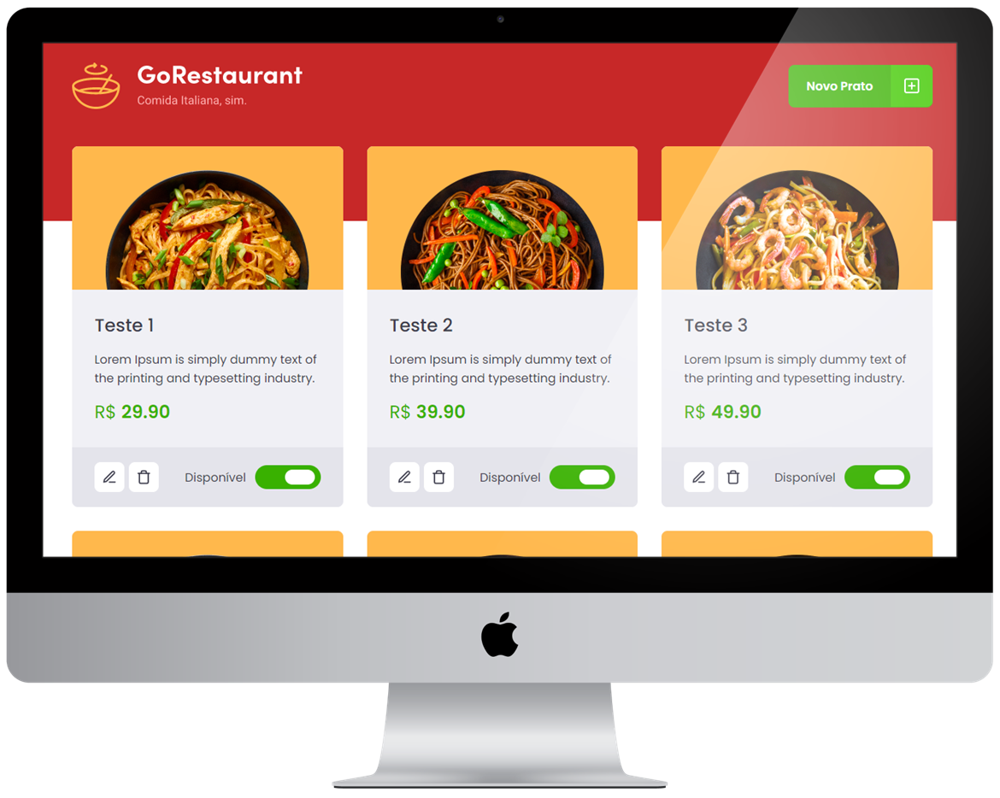

<h1 align="center">
         
</h1>

<p align="center">
  <a href="#-Projeto"></a>&nbsp;&nbsp;&nbsp;|&nbsp;&nbsp;&nbsp;
  <a href="#-Layout"></a>&nbsp;&nbsp;&nbsp;|&nbsp;&nbsp;&nbsp;
  <a href="#-Ambiente"></a>&nbsp;&nbsp;&nbsp;|&nbsp;&nbsp;&nbsp;
  <a href="#%EF%B8%8F-license"></a>
</p>

<br>

<br>

<p align="center">
 
</p>

<br>

## 💻 Projeto
<hr>

Terceiro desafio realizado no curso Ignite da [Rocketseat](https://rocketseat.com.br/).

Dado um template o desafio era realizar dois processos de migração:  

- Javascript para Typescript
- Class Components para Function Components.

Para concluir este desafio foi necessário alterar os seguintes documentos:

- src/components/Food/index.jsx;
- src/components/Food/styles.js;
- src/components/Header/index.jsx;
- src/components/Header/styles.js;
- src/components/Input/index.jsx;
- src/components/Input/styles.js;
- src/components/Modal/index.jsx;
- src/components/ModalAddFood/index.jsx;
- src/components/ModalAddFood/styles.js;
- src/components/ModalEditFood/index.jsx;
- src/components/ModalEditFood/styles.js;
- src/pages/Dashboard/index.jsx;
- src/pages/Dashboard/styles.js;
- src/routes/index.jsx;
- src/services/api.js;
- src/styles/global.js;
- src/App.js;
- src/index.js.

> Neste projeto foi possível aprofundar conhecimentos em tipagem estática.<br>
> Solucionar diversos erros de integração.<br>
> Praticar o uso de uma fake api com JSON server. <br>

<br>

## 🎨 Layout
<hr>
<p align="center">

</p>

<br>

## 📝 Ambiente
<hr>

1. Clonar o repositório:

```bash
git@github.com:CaioLemec/refactoring-classes-ts.git
```

2. Instale as dependências usando o comando:

```bash
 yarn
```

3. No seu terminal execute o comando para rodar o server:

```bash
yarn server
```

3. Abra outro terminal e execute o comando para rodar a aplicação:

```bash
yarn dev
```

4. acesse o endereço em um browser compatível:

```bash
http://localhost:3000/
```
<br>

## ⚖️ License
<hr>

Projeto licenciado por MIT [LICENSE](./LICENSE).
